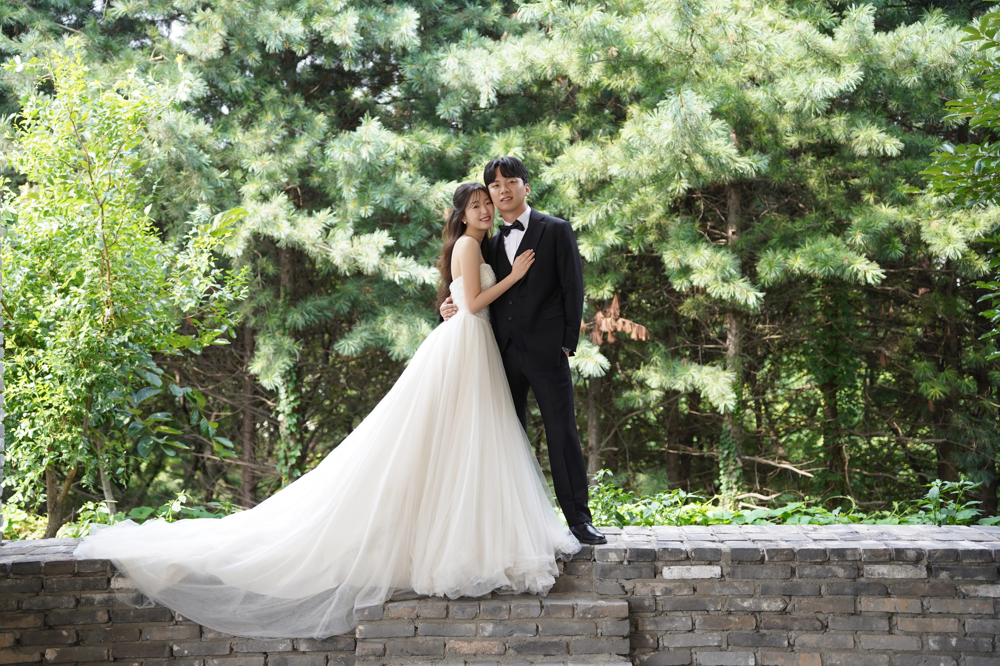
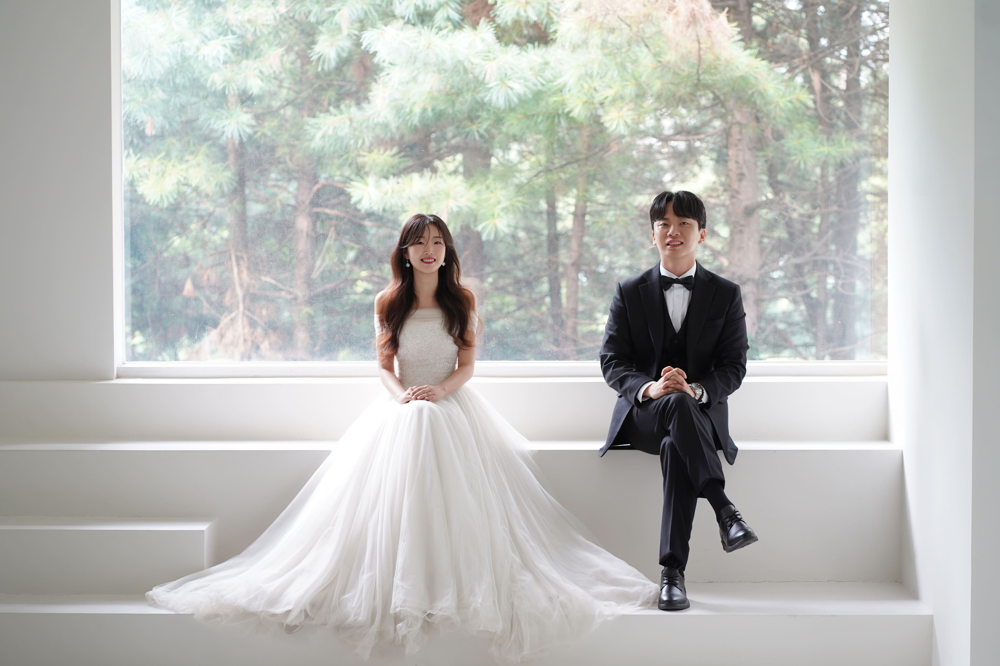

<!DOCTYPE html>
<html lang="ko">
<head>
<meta charset="UTF-8">
<meta name="viewport" content="width=device-width, initial-scale=1.0">
<title>장태근 & 한연수 결혼식 초대</title>

<!-- 폰트 -->
<link href="https://fonts.googleapis.com/css2?family=Dancing+Script:wght@500;600&display=swap" rel="stylesheet">
<link href="https://webfontworld.github.io/cafe24/Cafe24SsurroundAir.css" rel="stylesheet">

</head>
<body>

<!-- 하트 애니메이션 -->

<!-- 메인 슬라이드 -->

  
  
  
  
Jan Teageun & Han Yean-su

<!-- 카운트다운 -->
<section class="fade-in">
  <h2>Wedding Countdown</h2>
  

</section>

<!-- 중간 사진 -->
<section class="fade-in middle-photo">
  
</section>

<!-- 달력 -->
<section class="fade-in calendar-section">
  <h2>1월</h2>
  

    
일

월

화

수

목

금

토

    

1

2

3

    
4

5

6

7

8

9

10

    
11

12

13

14

15

16

17

    
18

19

20

21

22

23

24

    
25

    
26

27

28

29

30

31

  

</section>

<!-- 앨범 -->
<section class="fade-in">
  <h2>Album</h2>
  

  
    
    
  

</section>

<!-- 가족 -->
<section class="fade-in">
  <h2>Our Family</h2>
  
장경수 / 신현숙의 아들 <b>태근</b> <a href="tel:010-0000-0000" class="call-btn">📞</a>

  
한상근 / 이현지의 딸 <b>연수</b> <a href="tel:010-0000-0000" class="call-btn">📞</a>

</section>

<!-- 오시는 길 -->
<section class="fade-in">
  <h2 style="color:#EBCFC4;">오시는 길</h2>
  
경기 의정부시 시민로 70, 의정부 웨딩팰리스

  
문의 031-837-0101

  <iframe class="map" src="https://www.google.com/maps/embed?pb=!1m18!1m12!1m3!1d3155.2178040318595!2d127.04028137457112!3d37.73803421427772!2m3!1f0!2f0!3f0!3m2!1i1024!2i768!4f13.1!3m3!1m2!1s0x357cc735a7b9f213%3A0xfd65a43762c6d1fd!2z7Juo65Sp7Yyw66as7Iqk!5e0!3m2!1sko!2skr!4v1762446158857!5m2!1sko!2skr" allowfullscreen="" loading="lazy"></iframe>
  

    <a href="#" class="btn">카카오맵</a>
    <a href="#" class="btn">T맵</a>
    <a href="#" class="btn">네이버지도</a>
  

<!-- 교통 안내 -->
  

    <h3 style="color:#EBCFC4; font-size:1.1rem; font-weight:600;">교통 안내</h3>
    

      🚇 <strong>지하철:</strong> 1호선 의정부역 2번 출구 도보 5분 
      🚉 <strong>경전철:</strong> 경전철 의정부역 1번 
      🚌 <strong>버스:</strong> 의정부 시청 앞 하차 후 도보 3분
    

  

</section>

<!-- 마음 전할 곳 -->
<section id="account" class="fade-in">
  <h2 style="color:#EBCFC4; font-size:1.6rem; font-weight:600;">마음 전할 곳</h2>
  
두 사람의 새로운 시작을 따뜻한 마음으로 축복해 주세요.

   

    

    

      <h3 style="color:#EBCFC4;">🤵 신랑측</h3>
      
장태근 · 부모님 장경수 · 신현숙

      <button onclick="copyAccount('신한은행 110-123-456789 장태근')">계좌 복사하기</button>
    

      <h3 style="color:#EBCFC4;">👰 신부측</h3>
      
한연수 · 부모님 한상근 · 이현지

      <button onclick="copyAccount('국민은행 123-456-789012 한연수')">계좌 복사하기</button>
    

  

</section>

<!-- 방명록 -->
<section id="guestbook" class="fade-in">
  <h2 style="color:#EBCFC4;">방명록</h2>
  
축하의 한마디를 남겨주세요 ✨

  <form id="guestbookForm" style="max-width:400px; margin:0 auto; display:flex; flex-direction:column; gap:12px;">
    <input type="text" id="name" placeholder="이름" required>
    <textarea id="message" placeholder="축하 메시지를 입력해주세요" required></textarea>
    <button type="submit">남기기</button>
  </form>
  

</section>

<!-- BGM 버튼 -->
<button id="music-btn">🎵</button>
<audio id="bgm" loop preload="auto">
  <source src="C:\Users\USER\OneDrive\바탕 화면\wedding_invite\music.mp3.mp3" type="audio/mpeg">
</audio>

</body>
</html>
